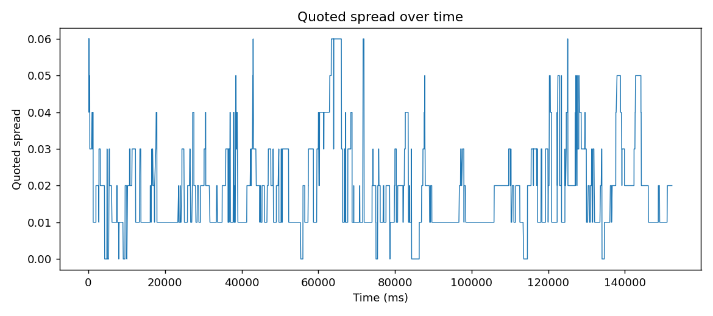
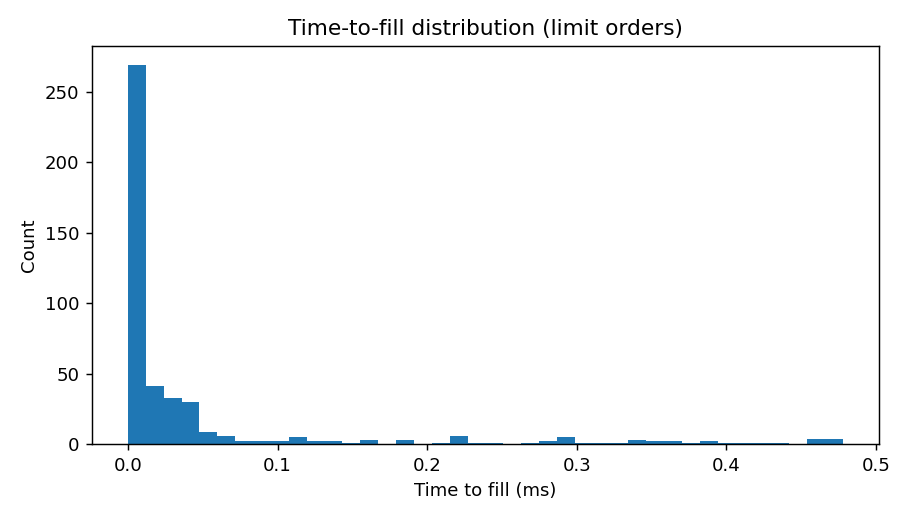
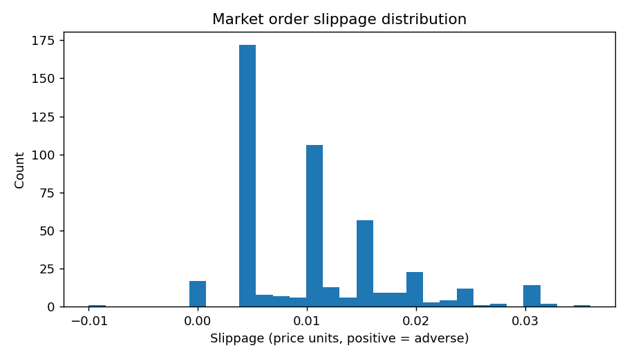

# Lock-Free Order Book in C++

A limit order book matching engine built to study lock-free concurrency, cache-conscious data layout, and price-time matching logic used in HFT systems. Includes three interchangeable price-level storage strategies, a benchmark harness, and a validation pipeline that replays synthetic order flow through the engine to check correctness and measure basic market behavior.

## What it does

- Matches limit and market orders with price-time (FIFO) priority
- Supports add, cancel, and market order types
- Logs every trade with price, quantity, aggressor ID, and resting order ID
- Ingests orders through a lock-free SPSC queue from a separate producer thread
- Can replay a synthetic order flow file through the engine and export fills and book snapshots for analysis (`ob.cpp --replay`)

## Architecture

### Order types and request dispatch

Uses `enum class Side` instead of strings for bid and ask, which avoids heap allocation and lets the compiler enforce exhaustive handling. Requests are dispatched through `std::variant<NewOrderRequest, CancelOrderRequest, MarketOrderRequest>` with `if constexpr` branching, so there is no virtual dispatch, no vtable, and no pointer indirection on the hot path.

### Matching engine

Single-threaded. Implements price-time priority: orders resting at the same price are matched in FIFO order. Matching runs before insertion, so an incoming order is matched against the opposite side first and only the unfilled remainder, if any, is added to the book.

Market orders use a sentinel price (positive infinity for bids, zero for asks) to sweep all available liquidity at the best prices. Any unmatched remainder is dropped rather than resting.

### Price level storage: three implementations

| Implementation | File | Lookup | Notes |
|---|---|---|---|
| `std::map<double, vector<Order>>` | `main_map.cpp` | O(log n) | Each tree node is a separate heap allocation; pointer chasing causes cache misses on traversal |
| Flat vector indexed by tick | `main.cpp` | O(1) | Prices convert to integer indices via `(price - min_price) / tick_size`; the whole price ladder sits contiguous in memory |
| Flat vector + sorted active-level index | `main_sorted_vec.cpp` | O(1), skips gaps | Extends the flat vector with a sorted `vector<int>` of occupied price indices, so the matching loop never iterates empty levels |

All three use lazy deletion: a `cancelled` flag on each `Order` lets the matching loop skip stale entries without restructuring the underlying vector, and a per-level active count tracks when a level empties out so it can be removed from the active index.

Cancel lookup goes through `Order_info` (price and side) and `Order_index` (position within the price level's vector). Cancel is not on the hot matching path, so the O(log n) lookup cost there is acceptable.

### SPSC queue

A fixed-size circular buffer connecting the producer thread to the consumer (matching engine) thread, with no mutexes.

Key design decisions:

- `head` and `tail` are `std::atomic<size_t>`, which prevents stale reads across cores
- Both are marked `alignas(64)` to place them on separate cache lines. Without this, two cores writing to different variables that share a cache line would still invalidate each other's cache constantly (false sharing)
- Writes use `memory_order_release` and reads use `memory_order_acquire`, which is sufficient for a single-producer single-consumer queue and avoids the full fence that `memory_order_seq_cst` would insert. This matters more on ARM than x86, but documents intent either way
- Head and tail are kept as raw, ever-increasing values for full/empty checks, with modulo applied only at array-index time. This avoids overflow handling since `size_t` wraps cleanly

## Performance

All benchmarks run 100K orders (80% limit, 20% market) through two threads, a producer and a consumer connected by the SPSC queue. Throughput is in orders per second.

| Implementation | Narrow range, 11 levels | Wide range, up to 10,000 levels | Realistic ticks, 1,000 levels, high churn |
|---|---|---|---|
| Map | 362,000 | 43,000 | 14,000 |
| Flat vector | 166,000 | 55,000 | 247,000 |
| Flat vector + sorted active | 174,000 | 94,000 | 331,000 |

**Narrow range (95-105, tick size 1.0).** The map wins here: 11 tree nodes fit entirely in cache, so traversal is nearly free, and the vector's sorted active-level bookkeeping is pure overhead at this scale.

**Wide range (1-10,000, tick size 1.0).** The vector takes over. Traversing a 10,000-node tree causes a cache miss on almost every lookup, while the vector's O(1) index access is unaffected by range. The sorted active-level index adds roughly another 70% by skipping empty slots.

**Realistic ticks (95.0-105.0 as doubles, tick size 0.01, 1,000 levels, high churn).** The vector wins by roughly 20x. Constant insertions and deletions scatter the map's tree nodes across the heap, and floating-point key comparisons add further overhead. The vector's performance is unaffected by either factor.

**Takeaway.** A map is only competitive when the number of active price levels is small and stable. As levels or churn increase, its cache-miss penalty compounds, while the flat vector's O(1) lookup scales independently of both, and the sorted active-level index removes the remaining cost of scanning empty slots between occupied ones.

## Correctness validation

Benchmarks confirm throughput, but say nothing about whether the matching logic is correct. To check that, `ob.cpp` gained a `--replay` mode: it reads a CSV of orders, feeds them through the real matching engine in order, and writes out every fill along with a snapshot of the best bid and ask before each order is processed.

```
./ob --replay orders.csv fills.csv book_snapshots.csv
```

`generate_order_flow.py` produces the input file: order arrivals follow a Poisson process, the mid-price follows a random walk, and orders are a mix of limit orders (priced at an exponentially distributed distance from the mid) and market orders.

Replaying this flow surfaced a real bug. The sell-side branch of `matching_loop` iterated resting bids (`activ_bid_idx`) starting from `begin()`, which is the **lowest** price in that sorted list. But a sell order should match against the **highest** bid first, and the bids that qualify (`price >= req.price`) sit at the end of that ascending list, not the start. Iterating from the front meant the loop could reach a low, non-qualifying bid, hit the `else { break; }`, and exit before ever checking a higher bid that should have matched. The result was resting orders left on both sides of a price that should have crossed: a crossed book.

The fix reverses the iteration for that branch, matching from the highest bid down (`activ_bid_idx.rbegin()` to `rend()`), with the corresponding erase adjusted for a reverse iterator. Every replay run since the fix has confirmed zero crossed states across the recorded book snapshots.

**Note on methodology.** `generate_order_flow.py` and `analyze_results.py` were written with AI assistance to a specification I set. The matching engine itself (`ob.cpp`, `main.cpp`, `main_map.cpp`, `main_sorted_vec.cpp`) is my own design and implementation, and the bug described above was found by reading the engine's actual output, not the tooling around it.

## Simulated market behavior

Running the current `orders.csv` through the fixed engine and analyzing the output (`analyze_results.py`) gives the following, over 3,000 synthetic orders:

| Metric | Value |
|---|---|
| Orders filled (at least partially) | 925 of 3,000 (30.8% by count, 29.2% by volume) |
| Time to fill, limit orders | median 0.00 ms, p90 0.17 ms, p99 0.47 ms |
| Quoted spread | mean 0.0185, median 0.0100 |
| Market order slippage | mean 0.0106, median 0.0100 (adverse to the taker, roughly one tick) |
| Price impact after a marketable trade | approximately zero in this sample |



The spread mostly sits between one and three ticks, with occasional widening to five or six ticks during periods of thinner resting liquidity. This is consistent with the exponential price-offset distribution used to generate resting limit orders.



Fill times are heavily right-skewed: most fills happen effectively immediately, with a long, thin tail out to half a millisecond. This matches expectations for orders that cross the spread on arrival versus ones that wait for the market to move to them.



Slippage clusters around 0.005 to 0.015, roughly half a tick to one and a half ticks, and is consistently positive (adverse to the taker), which is the expected direction for an aggressor crossing a live spread.

**Caveat.** The 30.8% fill rate and near-zero price impact are properties of this particular synthetic order flow, not general claims about the engine. Many resting limit orders in the generator are placed well away from the mid and simply never get reached in a short simulation window, and market order sizes here are small relative to resting depth, so they rarely walk through more than one price level. Neither number should be read as a benchmark of engine quality; the point of this exercise was correctness and directional sanity checks, not calibration against real market data.

## Known limitations

- Cancel orders are excluded from the multithreaded benchmark: the producer has no way to know the order IDs assigned by the matching engine without a separate feedback queue
- Tick size and price range are hardcoded near the top of each file; a production engine would read these from an instrument definition at startup
- Sorted active-level maintenance costs O(n) per insert or cancel, which is fine for typical books but degrades with a very large number of active levels
- The synthetic order generator's size and price-offset distributions are arbitrary choices, not calibrated to any real exchange's order flow, so the absolute fill-rate and slippage figures above are illustrative rather than representative

## How to run

**Requirements:** GCC 16+ with C++17 support. On Windows, install via MSYS2:

```bash
pacman -S mingw-w64-x86_64-gcc
```

**Compile and run each storage benchmark:**

```bash
# Map-based implementation
g++ -std=c++17 -O2 -o main_map main_map.cpp
./main_map

# Flat vector implementation
g++ -std=c++17 -O2 -o main main.cpp
./main

# Flat vector + sorted active levels (best performance)
g++ -std=c++17 -O2 -o main_sorted_vec main_sorted_vec.cpp
./main_sorted_vec
```

Each binary runs its benchmark automatically and prints total time, average latency, and throughput. To change the scenario, adjust `price_dist`, `max_price`, and `tick_size` near the top of the file.

**Run the correctness and behavior validation pipeline:**

```bash
# 1. Generate synthetic order flow
python3 generate_order_flow.py --n 3000 --start-price 100 --tick-size 0.01 --out orders.csv

# 2. Compile and run the engine in replay mode
g++ -std=c++17 -O2 -pthread -o ob ob.cpp
./ob --replay orders.csv fills.csv book_snapshots.csv

# 3. Analyze the results
python3 analyze_results.py --orders orders.csv --fills fills.csv --snapshots book_snapshots.csv --outdir report
```

## What I'd build next

- Wire the matching engine's output into a market data publisher thread over a second SPSC queue
- Pin the producer and consumer threads to specific CPU cores to remove scheduling jitter from the benchmark
- Replace the `Order_info` map with a flat array indexed by order ID for O(1) cancel lookup
- Calibrate the synthetic order generator against public tick data (for example, LOBSTER) instead of arbitrary distributions, so the fill-rate and slippage numbers reflect a realistic order flow rather than an illustrative one
